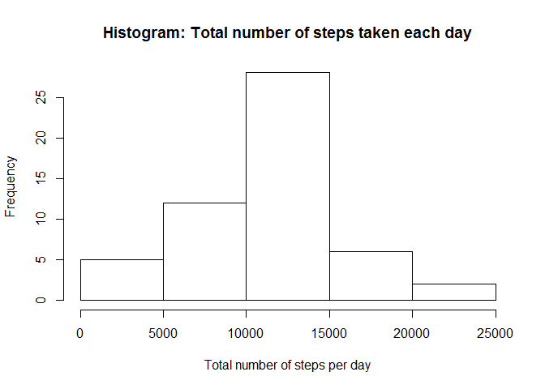

# Reproducible Research: Peer Assessment 1


## Loading and preprocessing the data


```r
data <- read.table(unz("activity.zip", "activity.csv"), header=TRUE, sep=",")
data.complete <- data[complete.cases(data), ]
```

## What is mean total number of steps taken per day?

To find out we calculate the total number of steps taken per day and draw a histogram showing the frequency distribution.


```r
total_steps_per_day <- aggregate(steps ~ date, data = data.complete, FUN = sum)
hist(total_steps_per_day$steps, main = "Histogram: Total number of steps taken each day", xlab = "Total number of steps per day")
```

 

Now we calculate and show the mean and median of the total number of steps taken per day:


```r
print(paste("Mean of total steps per day:", mean(total_steps_per_day$steps)))
```

```
## [1] "Mean of total steps per day: 10766.1886792453"
```

```r
print(paste("Median of total steps per day:", median(total_steps_per_day$steps)))
```

```
## [1] "Median of total steps per day: 10765"
```


## What is the average daily activity pattern?

To find out, we calculate the mean number of steps per five minutes interval.

Then we show the corresponding time series plot and mark the interval with the highest average number of steps accross all days.


```r
five_minutes_interval_steps_mean <- aggregate(steps ~ interval, data = data.complete, FUN = mean)
# Make the plot
plot(x = five_minutes_interval_steps_mean$interval, y = five_minutes_interval_steps_mean$steps, type = "l", main = "Daily activity pattern", xlab = "Five minutes interval step", ylab = "Mean number of steps")
# Mark the 5 minutes interval whis has the highest average steps per day with a red dotted line
abline(v = five_minutes_interval_steps_mean$interval[which.max(five_minutes_interval_steps_mean$steps)], col="red", lty=2)
```

 

The 5-minute interval, on average accross all days in the dataset, containing the maximum number of steps is: (Also see: Red dotted line in plot)


```r
five_minutes_interval_steps_mean$interval[which.max(five_minutes_interval_steps_mean$steps)]
```

```
## [1] 835
```


## Imputing missing values

The total number of rows with missing data (NA) in the dataset is:


```r
sum(!complete.cases(data))
```

```
## [1] 2304
```

Filling missing values with mean for that 5-minute interval.

The new dataset is called: data.filled


```r
# merging tables by interval
data.filled <- merge(data, five_minutes_interval_steps_mean, by = "interval")
# replacing NA's by average steps in that interval
for(i in 1:nrow(data.filled)) {
  if(is.na(data.filled$steps.x[i])) {
    data.filled$steps.x[i] <- data.filled$steps.y[i]
  }
}
# drop last column (steps.y), we do not need it anymore.
data.filled <- subset(data.filled, select=-4)
# rename steps.x column to steps
names(data.filled)[2] <- "steps"
```
Now we calculate the total number of steps taken per day and draw a histogram showing the frequency distribution of this new "imputed" dataset.


```r
total_steps_per_day <- aggregate(steps ~ date, data = data.filled, FUN = sum)
hist(total_steps_per_day$steps, main = "Histogram: Total number of steps taken each day (imputed dataset)", xlab = "Total number of steps per day")
```

 

Now we calculate and show the mean and median of the total number of steps taken per day:


```r
print(paste("Mean of total steps per day:", mean(total_steps_per_day$steps)))
```

```
## [1] "Mean of total steps per day: 10766.1886792453"
```

```r
print(paste("Median of total steps per day:", median(total_steps_per_day$steps)))
```

```
## [1] "Median of total steps per day: 10766.1886792453"
```
As we can se the the mean and median total number of steps has not changed significantly. (There is basically no change in that numbers).

The imputing of missing values has no significant impact on the estimate of the total daily numbers of steps.

What we can see is a change in the frequency of the distribution in the histogram, which makes sense, because we now have more data rows (measurements) to analize.


## Are there differences in activity patterns between weekdays and weekends?


```r
# Add a dayofweek column to the data frame
data.filled$dayofweek <- weekdays(as.POSIXct(data.filled$date))
# Add a weekend column to the data frame
data.filled$weekend[grepl("Saturday|Sunday", data.filled$dayofweek)] <- "Weekend"
data.filled$weekend[!grepl("Saturday|Sunday", data.filled$dayofweek)] <- "Weekday"

# convert weekend to factor
type_of_day <- as.factor(data.filled$weekend)

# aggregate steps to get average number of steps in interval(s) across weekdays/weekends
data.activity <- aggregate(steps ~ interval+type_of_day, data.filled, mean)

# We will use ggplot2
library(ggplot2)

p <- qplot(interval, steps, data=data.activity, geom=c("line"), xlab="Interval", 
      ylab="Mean number of steps", main="Differences in activity pattern") + facet_wrap(~ type_of_day, ncol=1)

print(p)
```

 

As we can see the persons weekends activity is generally more distributed throughout the day, while at weekdays the person shows higher activity in the first quarter of the day.

